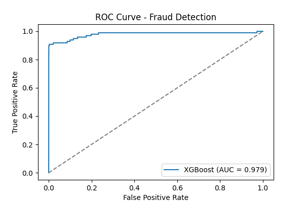

# 💳 Credit Card Fraud Detection

Detecting fraudulent credit card transactions using **XGBoost** on an imbalanced dataset.

---

## Problem Statement
Credit card fraud is rare but costly. In a dataset of **284,807 transactions**, only **492 (0.17%)** are fraudulent.  
👉 The challenge: train a model that **doesn’t just predict all transactions as “legit”** but can catch fraud effectively.

---

## Dataset
- **Rows:** 284,807  
- **Features:** 30 anonymized features + `Class` (target)  
- **Target distribution:**
  - Legitimate: 284,315  
  - Fraudulent: 492  

Dataset source: [Kaggle - Credit Card Fraud Detection](https://www.kaggle.com/mlg-ulb/creditcardfraud)

---

## ⚙️ Approach
1. **Data Preprocessing**  
   - Train-test split (80/20) with stratification.  

2. **Handling Imbalance**  
   - Applied **SMOTE** (Synthetic Minority Oversampling Technique).  

3. **Modeling**  
   - **XGBoost Classifier** (tuned for imbalanced classification).  

---

## Results

### Confusion Matrix
|                  | Predicted Legit (0) | Predicted Fraud (1) |
|------------------|----------------------|---------------------|
| **Actual Legit (0)** | 56832 ✅            | 32 ❌                |
| **Actual Fraud (1)** | 11 ❌               | 87 ✅                |

---

### Classification Report
| Metric       | Legit (0) | Fraud (1) |
|--------------|-----------|-----------|
| Precision    | 1.00      | 0.73      |
| Recall       | 1.00      | 0.89      |
| F1-Score     | 1.00      | 0.80      |

- **Accuracy:** 99.9%  
- **Macro F1:** 0.90  
- **ROC-AUC:** **0.979** 🎯 

---

### ROC Curve


---

## 🏆 Key Insights
- **High Recall (0.89):** Model catches 89% of frauds.  
- **Good Precision (0.73):** Some false alarms, but safer than missing fraud.  
- **Impact:** Reduces fraud risk while minimizing customer disruption.  

---

## 🛠️ Tech Stack
- Python  
- Pandas, NumPy  
- Scikit-learn, Imbalanced-learn (SMOTE)  
- XGBoost  
- Matplotlib  

---

## 🚀 Run the Project

### 1. Clone repository
```bash
git clone https://github.com/yourusername/fraud-detection.git
cd fraud-detection
```
###2. Install dependencies
```bash
pip install -r requirements.txt
```
###3.Run the model
```bash
python fraud_detection.py
```


